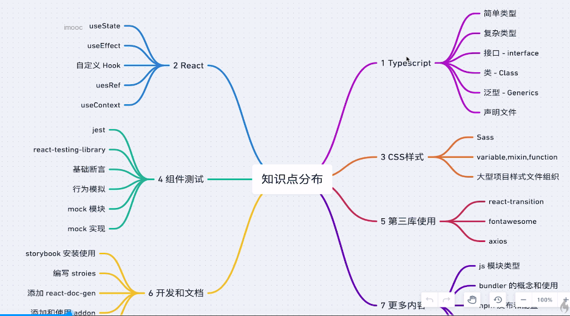
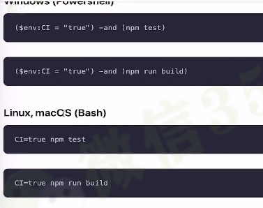
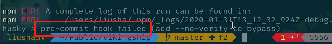

## 慕课网 React+TypeScript高仿AntDesign开发企业级UI组件库笔记



1.使用jest进行单元测试

```js
describe('test Button component', () => {
  it('should render the correct default button', () => {
    const wrapper = render(<Button {...defaultProps}>Nice</Button>)
    const element = wrapper.getByText('Nice') as HTMLButtonElement
    expect(element).toBeInTheDocument()
    expect(element.tagName).toEqual('BUTTON')
    expect(element).toHaveClass('btn btn-default')
    expect(element.disabled).toBeFalsy()
    fireEvent.click(element)
    expect(defaultProps.onClick).toHaveBeenCalled()
  })
  it('should render the correct component based on different props', () => {
    const wrapper = render(<Button {...testProps}>Nice</Button>)
    const element = wrapper.getByText('Nice')
    expect(element).toBeInTheDocument()
    expect(element).toHaveClass('btn-primary btn-lg klass')
  })
  it('should render a link when btnType equals link and href is provided', () => {
    const wrapper = render(<Button btnType='link' href="http://dummyurl">Link</Button>)
    const element = wrapper.getByText('Link')
    expect(element).toBeInTheDocument()
    expect(element.tagName).toEqual('A')
    expect(element).toHaveClass('btn btn-link')
  })
  it('should render disabled button when disabled set to true', () => {
    const wrapper = render(<Button {...disabledProps}>Nice</Button>)
    const element = wrapper.getByText('Nice') as HTMLButtonElement
    expect(element).toBeInTheDocument()
    expect(element.disabled).toBeTruthy()
    fireEvent.click(element)
    expect(disabledProps.onClick).not.toHaveBeenCalled()
  })
})
```

2.使用storybook 生成项目文档具体配置可以参考.storybook/config.tsx

```js
storiesOf('Button Component', module)
  .add('Button', defaultButton)
  .add('不同尺寸的 Button', buttonWithSize)
  .add('不同类型的 Button', buttonWithType)
```

3.使用cross-env进行不同系统的命令转换(win与mac相同动作的命令可能不同)



4.peerDependencies:

如果使用的插件依赖react,而自己编写的项目又依赖于react,那么react会被打包两次,这时候写在peerDependencies中可以使他们的版本相同,打包也只会打包一个react,可以使依赖扁平化.教程:https://blog.csdn.net/astonishqft/article/details/105671253

```
  "peerDependencies": {
    "react": ">=16.8.0",
    "react-dom": ">=16.8.0"
  },
```

5.npm link 可以把当前的依赖指定到一个npm的全局依赖

6.npm 命令:

"lint": "eslint --ext js,ts,tsx src --max-warnings 5", 可是设置eslint警告超过5个就报错

"test:nowatch": "cross-env CI=true react-scripts test", eslint普通情况下为开发模式,不是输出结果,使用这个命令可以输出结果,如果测试通过,执行下面的命令,不通过则退出

7.husky: git commit前的自动检查(钩子函数)



```json
  "husky": {
    "hooks": {
      "pre-commit": "npm run test:nowatch && npm run lint"
    }
  }
```

7.使用travis ci 免费工具自动化部署前端代码

配置文件:.travis.yml

注册授权github之后会自动读取github仓库所有内容,添加.travis.yml之后会在git commit自动部署

package.json命令:prepublish会在install和build时都运行,该命令将要废弃,因此使用prepublishOnly代替

webpack打包UMD学习记录:https://blog.csdn.net/weixin_42947716/article/details/124104045