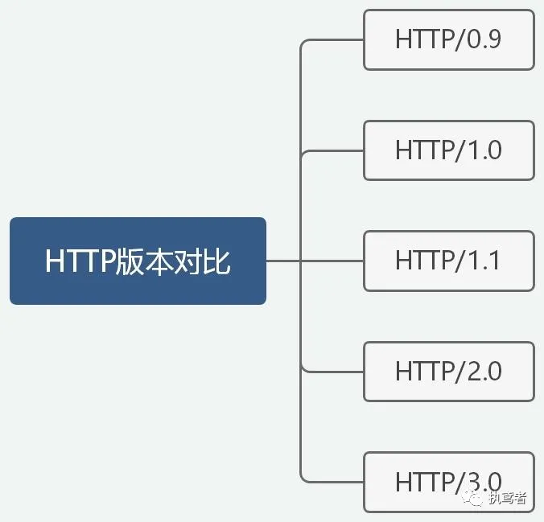
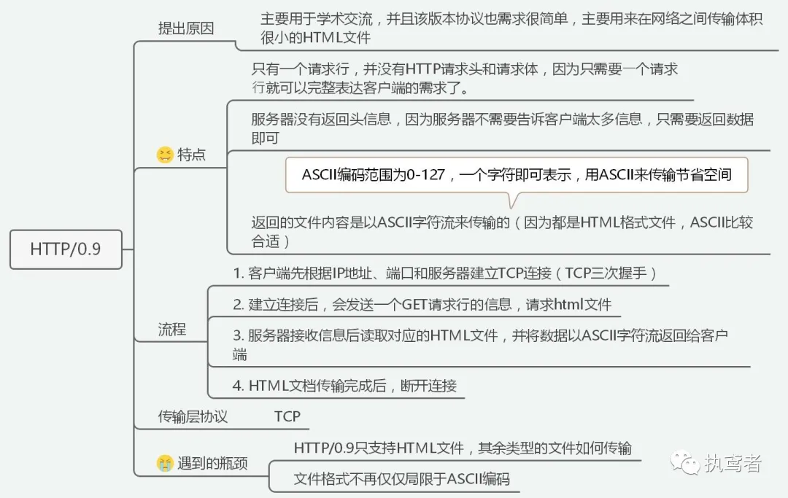
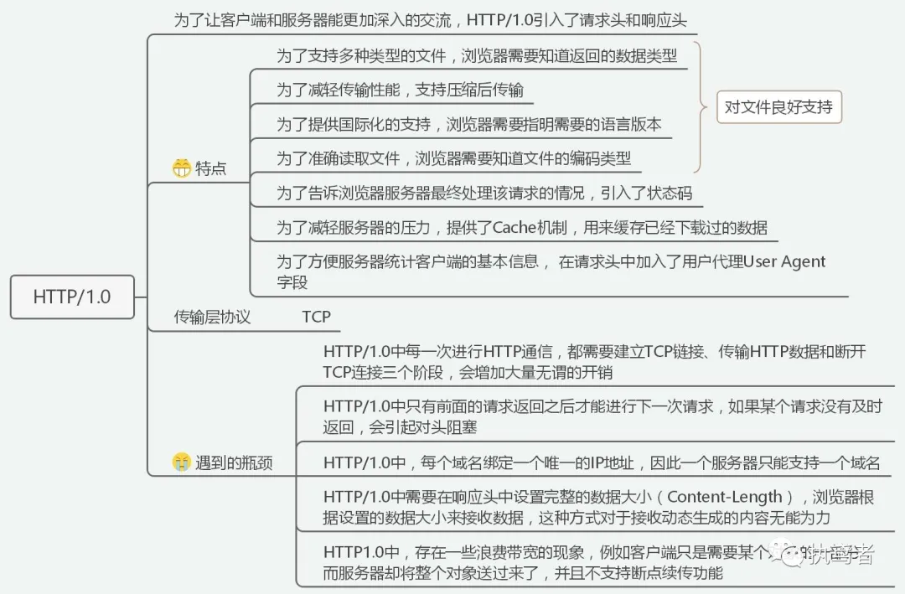
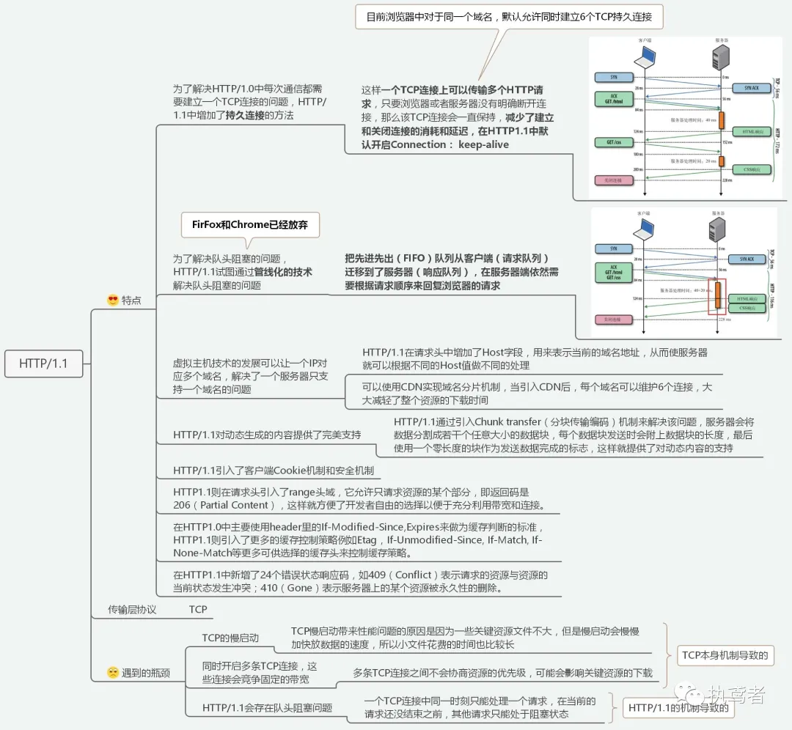
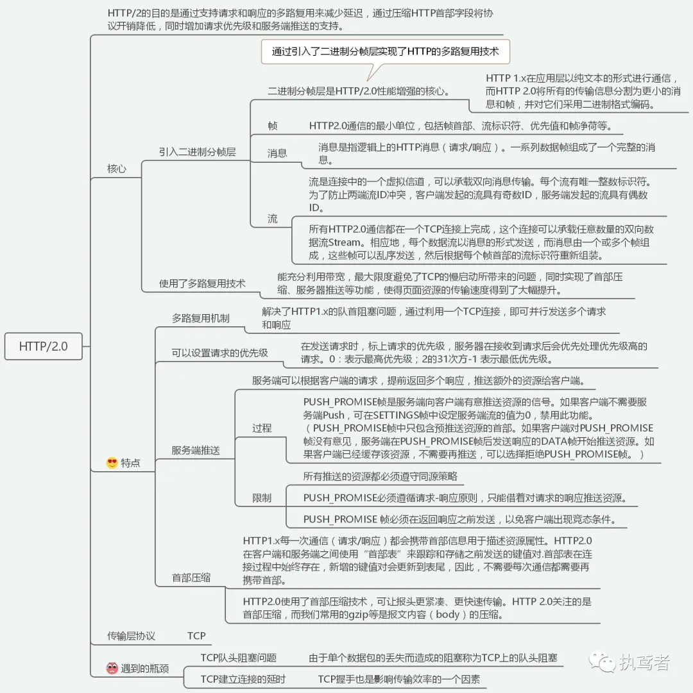
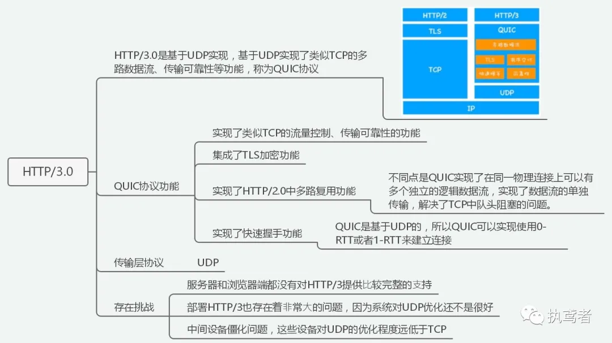

## 六张图带你从HTTP/0.9进化到HTTP3.0

> HTTP其实可以分为四个阶段，分别是HTTP/0.9、HTTP/1.x、HTTP/2.0、HTTP3.0，正是因为前面存在瓶颈问题，所以才会出现新的版本来弥补这些瓶颈问题。

## 一、HTTP/0.9

## 二、HTTP/1.x

### 2.1 HTTP/1.0

### 2.2 HTTP/1.1

## 三、HTTP/2.0

## 四、HTTP/3.0

> 